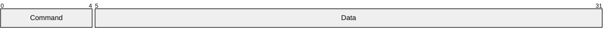

# Commands from app to reciver and vice verca



# Command 1
MPU 6050 accelerometer and gyroscope sensor
with float data
```cpp
uint8_t report_id =0x06;    //[1 byte]
unsigned int command ;               //[4 bytes]
float Ax;                   //[4 bytes]
float Ay;                   //[4 bytes]
float Az;                   //[4 bytes] 
float Gx;                   //[4 bytes]
float Gy;                   //[4 bytes]
float Gz;                   //[4 bytes]
uint8_t padding[35]=0;
```

# Command 2
Buttton presses
```cpp
uint8_t report_id =0x06;    //[1 byte]
unsigned int command ;               //[4 bytes]
int ButtonNumber;
bool falling ;  
```

